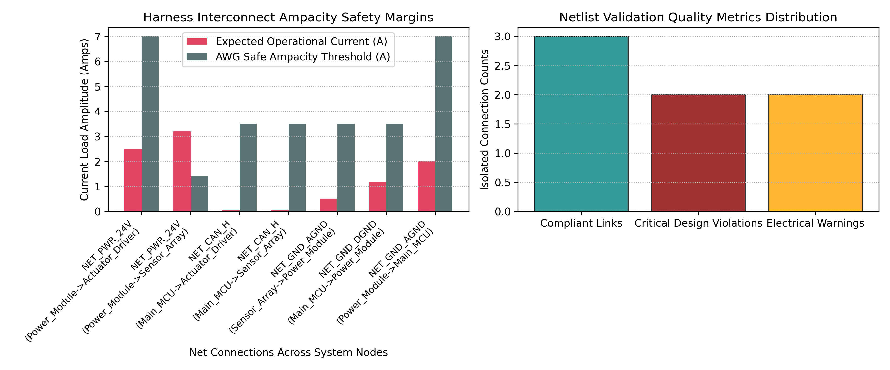

# Automated Wire Harness Interconnect Design Validation Pipeline

## 📌 Project Overview
This repository contains a structural design rule checking (DRC) and electrical linting validation engine implemented in Python. In complex multi-board systems (such as automotive electronic control units, aerospace telemetry racks, and industrial robotics), wire harnesses serve as the physical backbone linking distinct sub-assemblies. Manual verification of thousands of pin connections across complex multi-page schematics is notoriously error-prone. This software framework automates the ingestion of raw Computer-Aided Design (CAD) netlist connectivity profiles to analytically flags hardware assembly errors—including wire ampacity violations, net name pin mismatches, and ground loop risks—prior to manufacturing layout release.

## ⚡ Technical Architecture
The validation software architecture executes an end-to-end linting check over four operational processing blocks:
* **CAD Netlist Ingestion Parser:** Imports system connectivity files mapping source/destination components, pin identifiers, wire gauge metrics (AWG), and expected operational electrical currents.
* **Thermal Ampacity Audit Engine:** Evaluates functional wire cross-sections against worst-case chassis environment continuous current rating capacities to calculate safe operating boundaries.
* **Signal Pinout Verification Module:** Processes pin designations on structural network nodes to cross-check differential communication interfaces (e.g., CAN-Bus high/low pathways) and flag endpoint configuration mismatches.
* **Ground Loop Hazard Mapper:** Tracks ground returns through distinct topological nodes across sub-boards, throwing automated safety alerts if analog and digital reference planes intersect in ways that introduce systemic EMI loops.

## 📊 Pipeline Compliance & Diagnostic Outputs
The validation framework was rigorously tested against a simulated multi-board hardware configuration containing intentional design flaws:



* **Harness Interconnect Ampacity Safety Margins:** The diagnostic bar plot computes peak operational current loads directly against safe AWG continuous thresholds. The engine isolates an intense thermal overstress condition on the 24V power net where an AWG 28 track experiences a $3.2\text{A}$ load, far exceeding its conservative safety boundary of $1.4\text{A}$.
* **Netlist Validation Quality Metrics Distribution:** The telemetry dashboard successfully isolated **4 system design violations** from the net architecture:
  * **Critical Ampacity Overloads:** Highlighted physical traces operating beyond safe thermal design thresholds.
  * **Critical Pin Mismatches:** Fladdged a CAN bus node terminating at a non-standard physical pin position (`J3-P9` instead of standard differential pairings).
  * **Ground Return Warning Loops:** Localized dangerous common-impedance paths on both the `Power_Module` and `Main_MCU` nodes where digital return currents threaten sensitive analog reference channels.

## 🛠️ How to Replicate
1. Launch the file `notebooks/wire_harness_validation_pipeline.ipynb` inside [Google Colab](https://colab.research.google.com/).
2. Run the processing cells sequentially to construct the mock hardware interconnect netlists, activate the design rule validation checkers, and plot the current capacity margins.
3. The validation engine logs direct system level vulnerability summaries to the terminal environment and outputs high-resolution performance bar layouts.

## 📂 Repository Structure
```text
├── notebooks/          # Automated CAD netlist parsing and validation notebooks
├── assets/             # Generated wire harness rule check graphs and ampacity layouts
└── README.md           # Professional project documentation
